# 숙소 모바일 가이드 제작용 고객 자료 요청 가이드

이 문서는 새로운 숙소의 모바일 가이드를 제작할 때 고객에게 어떤 자료를 받아야 하는지, 어떤 사진을 어떻게 찍어야 하는지, 어떤 정보는 AI가 보완 검색할 수 있는지를 한 번에 정리한 표준 요청서입니다.

목표는 고객이 이 문서를 따라 하기만 해도 제작에 필요한 자료가 빠짐없이 모이도록 하는 것입니다.

---

## 1. 진행 방식 한눈에 보기

1. 고객이 이 문서를 읽고 기본 정보를 작성합니다.
2. 숙소 사진을 촬영 가이드에 맞춰 촬영합니다.
3. 도어락, 와이파이, 가전, 쓰레기, 주차, 체크인 규칙을 정리합니다.
4. 기존에 쓰던 PDF, 노션, 에어비앤비 메시지, 안내문이 있으면 모두 전달합니다.
5. 제작자가 누락 정보를 확인하고, 공항 이동 방법/대중교통/지도/맛집 등은 AI 검색으로 보완합니다.
6. 고객이 AI가 보완한 내용을 최종 확인합니다.
7. 모바일 가이드 초안을 제작합니다.
8. 고객이 실제 투숙객 관점으로 검수하고 최종 배포합니다.

---

## 2. 고객에게 반드시 받아야 하는 정보

아래 항목은 AI가 정확히 알 수 없거나, 잘못 안내되면 고객 경험과 운영에 직접 문제가 생기는 정보입니다. 반드시 고객에게 받아야 합니다.

### 2.1 숙소 기본 정보

| 항목 | 고객 작성 내용 |
|---|---|
| 숙소명 | 예: EXTAY Mansion Haebangchon |
| 표시할 브랜드명 | 예: EXTAY |
| 정확한 주소 | 도로명 주소, 건물명, 층수, 호수 |
| 숙소 유형 | 아파트, 단독주택, 빌라, 게스트하우스, 호텔형 숙소 등 |
| 기준 인원 / 최대 인원 | 예: 기준 4명, 최대 6명 |
| 체크인 시간 | 예: 16:00 |
| 체크아웃 시간 | 예: 11:00 |
| 얼리 체크인 / 레이트 체크아웃 가능 여부 | 가능 조건과 비용 |
| 주차 가능 여부 | 건물 주차 가능/불가, 유료 주차장 안내 여부 |
| 엘리베이터 여부 | 있음/없음, 계단 이용 안내 |

### 2.2 연락처와 운영 정보

| 항목 | 고객 작성 내용 |
|---|---|
| 호스트 전화번호 | 투숙객에게 보여줄 번호 |
| 카카오톡 오픈채팅 URL | 있으면 전달 |
| 긴급 연락 방법 | 전화, 문자, 카카오톡 등 우선순위 |
| 응대 가능 시간 | 예: 09:00-23:00 |
| 야간 긴급 상황 기준 | 누수, 정전, 도어락 문제 등 |

### 2.3 체크인 안내

| 항목 | 고객 작성 내용 |
|---|---|
| 체크인 방식 | 비대면 셀프 체크인 / 대면 체크인 |
| 키 전달 방식 | 도어락, 키박스, 카드키, 현관 비밀번호 등 |
| 도어락 사용 순서 | 예: 키패드 터치 → 번호 입력 → * |
| 개인 키번호 발송 시점 | 예: 체크인 당일 12시 |
| 입구 찾는 방법 | 큰길, 골목, 상가, 현관 위치 설명 |
| 건물 출입 시 주의점 | 공동현관, 계단, 엘리베이터, 소음 주의 등 |
| 체크인 문제 발생 시 연락 방법 | 전화/메시지 |

도어락 번호 자체는 문서에 고정으로 넣지 않는 것을 권장합니다. 예약자별로 메시지에서 별도 안내하는 방식이 안전합니다.

### 2.4 와이파이 정보

| 항목 | 고객 작성 내용 |
|---|---|
| Wi-Fi 이름 | 대소문자 정확히 |
| Wi-Fi 비밀번호 | 대소문자, 숫자, 특수문자 정확히 |
| 2.4G / 5G 구분 | 둘 다 있으면 둘 다 작성 |
| 연결이 안 될 때 조치 | 공유기 위치, 재부팅 가능 여부 등 |
| 공유기 위치 | 투숙객에게 알려도 되는 경우만 |

### 2.5 숙소 규칙

| 항목 | 고객 작성 내용 |
|---|---|
| 금연 규칙 | 실내, 베란다, 계단, 현관 등 |
| 흡연 가능 장소 | 있다면 정확한 위치 |
| 반려동물 가능 여부 | 가능/불가 |
| 방문자 입실 가능 여부 | 예약 인원 외 방문 가능 여부 |
| 소음/매너타임 | 예: 21시 이후 조용히 |
| 취사 규칙 | 간단 취사 가능, 냄새 강한 음식 금지 등 |
| 파티/이벤트 가능 여부 | 가능/불가 |
| 상업 촬영 가능 여부 | 가능/불가 |
| 파손/분실 비용 안내 | 필요한 경우 |

### 2.6 가전과 시설 사용법

다음 중 숙소에 있는 것만 작성합니다.

| 항목 | 필요한 내용 |
|---|---|
| TV / OTT | 리모컨 종류, 외부입력, 넷플릭스/유튜브 사용법 |
| 보일러 / 온수 | 조절기 위치, 버튼 순서, 권장 온도 |
| 에어컨 / 난방 | 리모컨 위치, 모드, 주의사항 |
| 세탁기 | 전원, 코스, 세제 위치, 사용 가능 시간 |
| 건조기 | 코스, 필터 청소 여부, 소음 주의 |
| 인덕션 / 가스레인지 | 사용법, 환기, 금지 음식 |
| 전자레인지 / 오븐 | 기본 사용법 |
| 정수기 / 커피머신 | 사용법, 캡슐/필터 안내 |
| 비품 보관함 | 위치, 비밀번호, 제공 품목 |
| 루프탑 / 테라스 | 이용 가능 시간, 소음 주의 |
| 공용 화장실 / 공용 공간 | 위치, 비밀번호, 사용 조건 |

### 2.7 쓰레기와 퇴실 안내

| 항목 | 고객 작성 내용 |
|---|---|
| 일반 쓰레기 위치 | 실내 보관 위치와 배출 위치 |
| 음식물 쓰레기 위치 | 음식물통, 건물 배출함 |
| 재활용 위치 | 베란다, 건물 분리수거장 등 |
| 종량제 봉투 위치 | 제공 여부와 위치 |
| 퇴실 전 해야 할 일 | 설거지, 에어컨 끄기, 창문 닫기 등 |
| 체크아웃 초과 비용 | 있으면 정확히 |

---

## 3. AI가 보완 검색할 수 있는 정보

아래 항목은 AI가 공개 정보와 지도 검색으로 초안을 만들 수 있습니다. 단, 최종 반영 전 고객 확인이 필요합니다.

| 항목 | AI 작업 가능 범위 | 고객 확인 필요 여부 |
|---|---|---|
| 공항에서 숙소까지 이동 방법 | 인천공항/김포공항 대중교통, 택시, 리무진 경로 정리 | 필요 |
| 대중교통 길찾기 | 지하철역, 버스, 도보 구간 안내 | 필요 |
| 네이버 지도/구글 지도 링크 | 주소 기반 링크 생성 | 필요 |
| 주변 유료 주차장 | 공개 지도 기반 후보 정리 | 필요 |
| 주변 맛집 | 카테고리별 후보 조사, 지도 링크 정리 | 필요 |
| 주변 편의시설 | 편의점, 약국, 마트, 카페 등 | 필요 |
| 관광지/동네 소개 | 공개 정보 기반 간단 소개 | 필요 |
| FAQ 초안 | 기존 메시지와 숙소 정보 기반 질문 추출 | 필요 |

AI가 검색한 내용은 운영자의 실제 경험과 다를 수 있습니다. 특히 영업시간, 폐업 여부, 주차 가능 여부, 막차 시간, 요금은 변동될 수 있으므로 최종 검수해야 합니다.

---

## 4. 사진 촬영 가이드

사진은 모바일 가이드의 품질을 가장 크게 좌우합니다. 아래 기준에 맞춰 촬영하면 별도 전문 촬영 없이도 충분히 고급스러운 결과를 만들 수 있습니다.

### 4.1 공통 촬영 기준

- 스마트폰 기본 카메라로 촬영해도 됩니다.
- 필터, 과한 보정, 인물 스티커, 앱 로고를 넣지 마세요.
- 가능하면 낮 시간 자연광에서 촬영하세요.
- 조명은 모두 켜고, 커튼은 공간이 가장 좋아 보이게 조정하세요.
- 세로 사진과 가로 사진을 모두 촬영하세요.
- 흔들림 없이 수평을 맞추세요.
- 쓰레기, 개인 물건, 청소도구, 택배박스, 노출되면 안 되는 문서가 보이지 않게 정리하세요.
- 도어락 비밀번호, 와이파이 비밀번호, 예약자명, 개인정보가 사진에 나오지 않게 하세요.

권장 해상도:

- 최소 2000px 이상
- 가능하면 원본 사진 그대로 전달
- JPG, PNG, HEIC 가능

### 4.2 촬영 예시 이미지

아래 이미지는 실제 촬영 구도 예시입니다. HTML 문서에서는 유형별 넘겨보기로 확인할 수 있고, Markdown에서는 필요한 유형만 펼쳐서 보면 됩니다.

<details>
<summary><strong>히어로/거실 예시 보기</strong></summary>

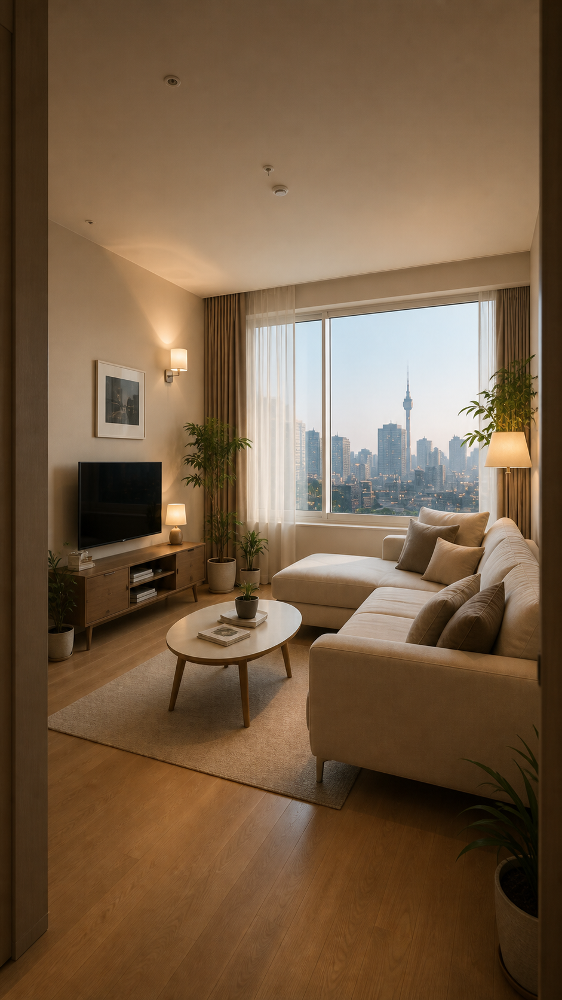

입구나 코너에서 공간을 넓게 담고, 창문과 조명까지 함께 보이게 촬영합니다. 세로 9:16 사진을 반드시 1장 이상 촬영하세요.

</details>

<details>
<summary><strong>침실 예시 보기</strong></summary>

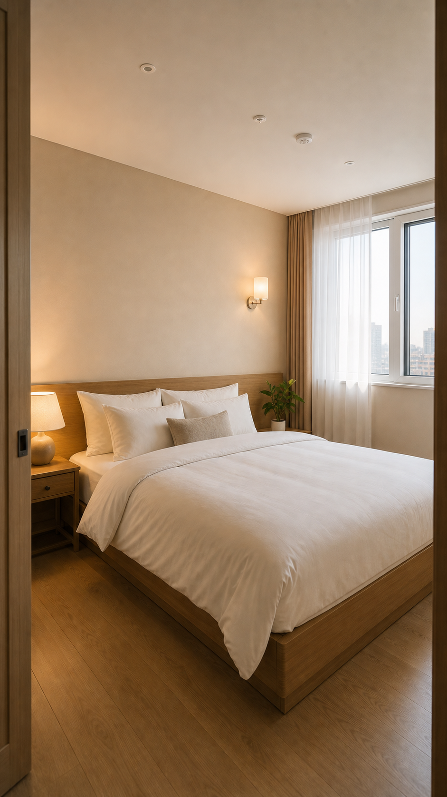

방 입구나 모서리에서 침대 전체, 조명, 수납 위치가 함께 보이도록 촬영합니다. 콘센트, 협탁, 조명처럼 투숙객이 찾는 요소도 함께 포함하세요.

</details>

<details>
<summary><strong>주방 예시 보기</strong></summary>

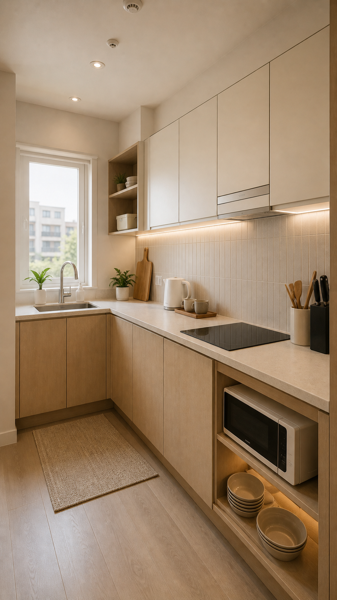

조리대, 싱크대, 인덕션, 식기 위치가 한눈에 들어오도록 넓게 찍습니다. 제공 비품은 정리된 상태로 별도 컷을 추가하세요.

</details>

<details>
<summary><strong>욕실 예시 보기</strong></summary>

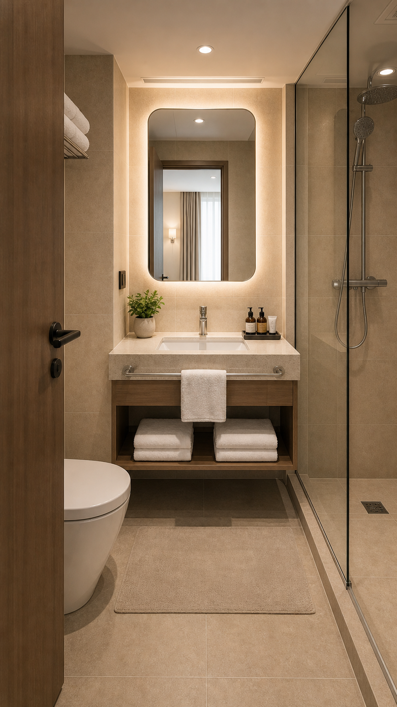

입구에서 세면대, 샤워공간, 수건과 어메니티가 함께 보이도록 촬영합니다. 거울 반사에 촬영자나 사적 물건이 나오지 않게 주의하세요.

</details>

<details>
<summary><strong>창밖/뷰 예시 보기</strong></summary>

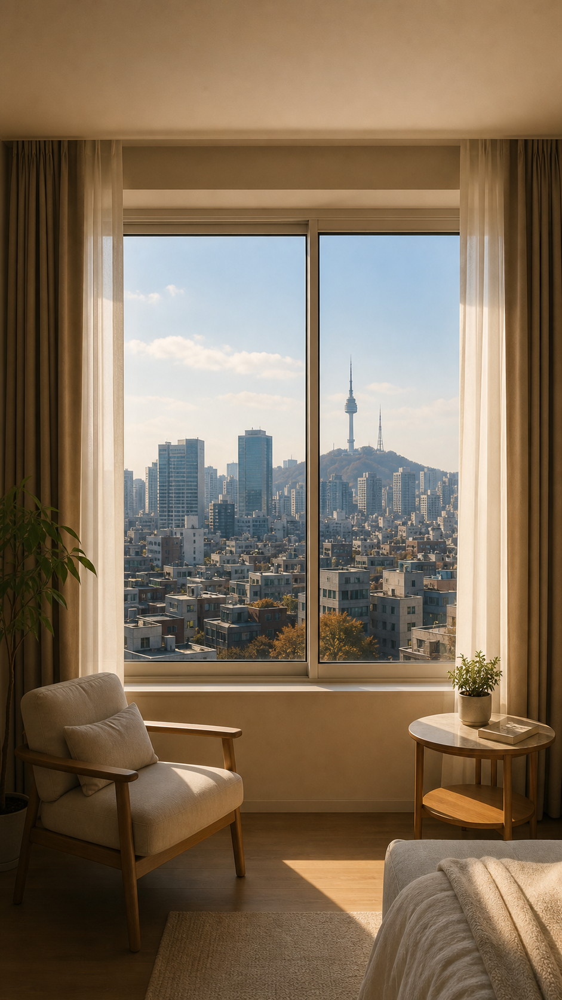

실내 프레임과 바깥 풍경을 함께 담아 숙소에서 보이는 실제 분위기를 전달합니다. 낮과 저녁 뷰가 다르면 각각 1장씩 추가 촬영하세요.

</details>

<details>
<summary><strong>체크인 동선 예시 보기</strong></summary>

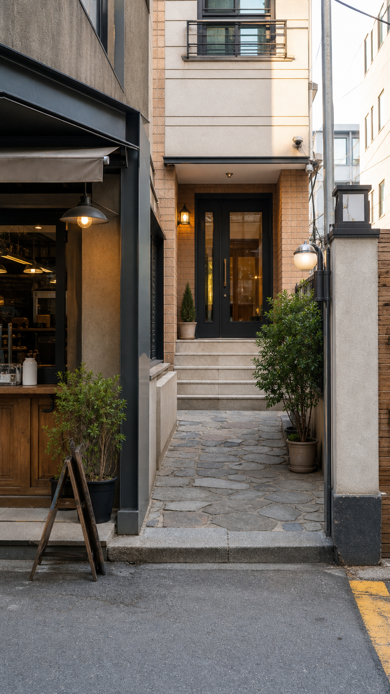

골목 기준점, 건물 외관, 현관문이 한 프레임에 들어오도록 정면에서 찍습니다. 입구, 계단, 엘리베이터는 이동 순서대로 추가 촬영하세요.

</details>

<details>
<summary><strong>도어락/가전 예시 보기</strong></summary>

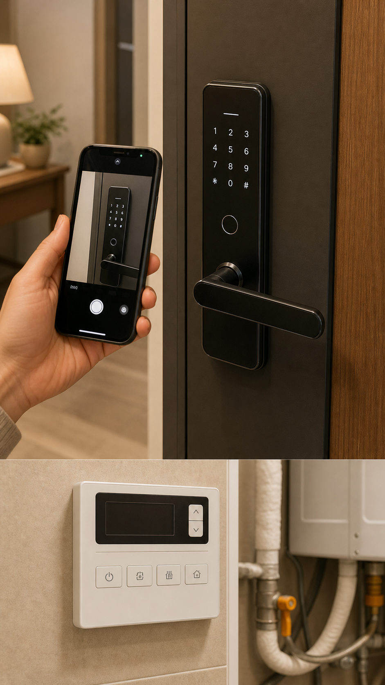

조작해야 하는 위치가 선명하게 보이도록 가까이 찍고, 실제 비밀번호는 가립니다. 전체 위치 사진 1장과 버튼 근접 사진 1장을 함께 준비하세요.

</details>

<details>
<summary><strong>와이파이/공유기 예시 보기</strong></summary>

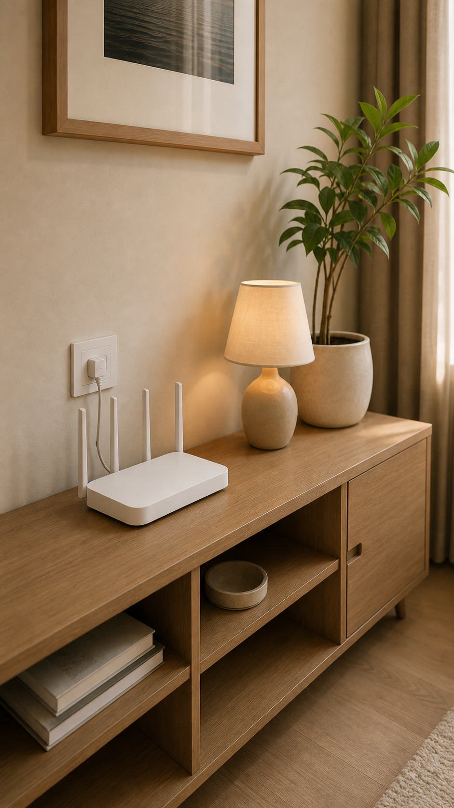

공유기를 알려줘야 하는 경우 위치와 주변 기준점이 함께 보이도록 촬영합니다. 비밀번호 스티커, QR 코드, 네트워크 라벨은 보이지 않게 처리하세요.

</details>

<details>
<summary><strong>TV/리모컨 예시 보기</strong></summary>

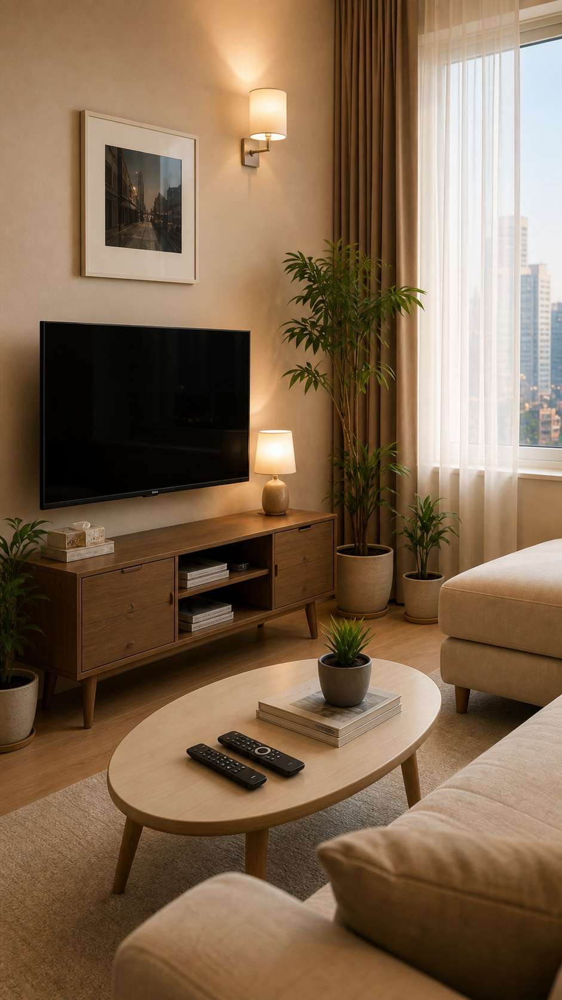

TV 위치와 리모컨을 한 프레임에 담고, 주요 조작부는 별도로 가까이 찍습니다. TV 화면에는 개인 계정이나 시청 기록이 보이지 않게 주의하세요.

</details>

<details>
<summary><strong>세탁/건조 예시 보기</strong></summary>

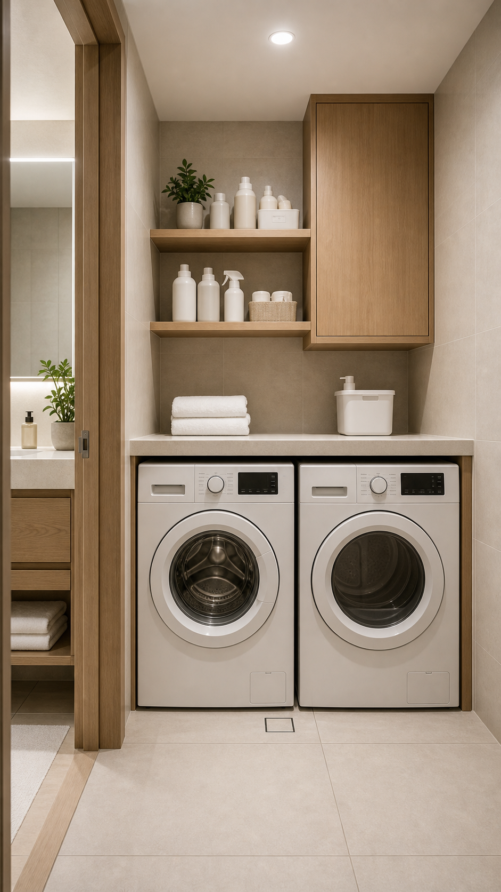

세탁기나 건조기의 전체 위치, 조작부, 세제 보관 위치가 함께 보이게 촬영합니다. 사용 가능한 세제와 투입구 위치를 별도 컷으로 추가하세요.

</details>

<details>
<summary><strong>쓰레기/비품 예시 보기</strong></summary>

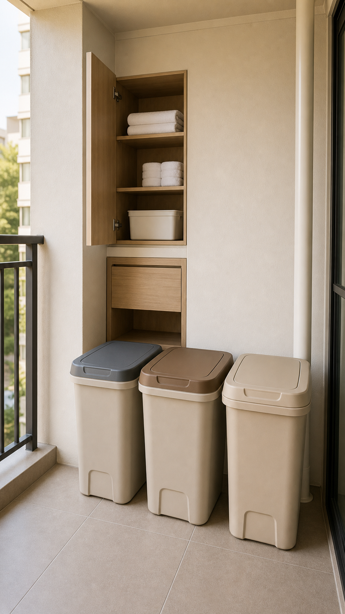

투숙객이 바로 찾을 수 있게 보관함, 통, 주변 기준점을 함께 보여줍니다. 일반, 음식물, 재활용 위치가 구분되게 촬영하세요.

</details>

<details>
<summary><strong>주차/주변길 예시 보기</strong></summary>

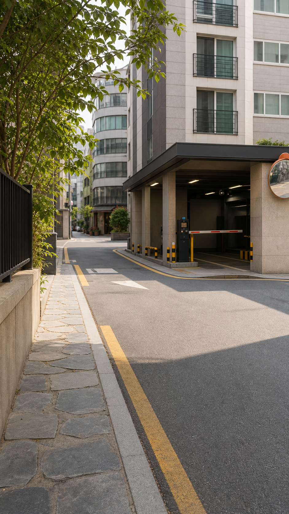

주차장 입구나 숙소까지 오는 길을 실제 보행자 시야 기준으로 촬영합니다. 차량 번호판, 사적 주소, 읽을 수 있는 민감 표기는 제외하세요.

</details>

### 4.3 필수 사진 목록

| 구분 | 필요 수량 | 촬영 방법 |
|---|---:|---|
| 대표 히어로 사진 | 3-5장 | 거실, 침실, 창밖 뷰 등 숙소 첫인상을 보여주는 사진 |
| 거실 | 4-8장 | 입구 쪽에서 전체, 창가 쪽에서 반대 방향, 소파/테이블 디테일 |
| 침실 | 각 방 3-5장 | 침대 전체, 침구 디테일, 조명 켠 사진 |
| 주방 | 3-5장 | 전체 구조, 조리 공간, 식기/비품 위치 |
| 욕실 | 3-5장 | 전체, 세면대, 샤워공간, 어메니티 |
| 창밖/뷰 | 2-5장 | 낮/저녁 가능하면 둘 다 |
| 현관/입구 | 3-6장 | 건물 입구, 골목 입구, 현관문, 계단/엘리베이터 |
| 도어락 | 2-4장 | 비밀번호가 보이지 않게, 키패드 위치 중심 |
| 와이파이/공유기 | 1-2장 | 공유기 위치를 알려도 되는 경우만 |
| TV/리모컨 | 2-4장 | TV 화면, 리모컨 버튼, OTT 기기 |
| 보일러/온수 조절기 | 2-4장 | 위치가 보이는 사진, 버튼이 보이는 근접 사진 |
| 세탁기/건조기 | 2-4장 | 전체, 조작부, 세제 위치 |
| 쓰레기/분리수거 위치 | 2-5장 | 실내 보관 위치, 건물 배출 위치 |
| 비품 보관함 | 2-5장 | 위치, 내부 구성. 비밀번호는 노출하지 않기 |
| 주차/주변 길 | 필요 시 3-6장 | 주차장 입구, 숙소까지 오는 골목 |

### 4.4 사진별 촬영 팁

#### 히어로 사진

- 숙소의 가장 좋은 공간을 넓게 보여주세요.
- 세로 9:16 비율로 한 장 이상 찍어주세요.
- 창문, 조명, 침구, 소파처럼 분위기를 만드는 요소가 같이 보이면 좋습니다.
- 너무 어둡거나 역광이 심하면 피하세요.

#### 객실 둘러보기 사진

- 방마다 입구에서 안쪽을 향해 한 장, 안쪽에서 입구를 향해 한 장 찍습니다.
- 침대는 정돈된 상태에서 베개와 이불 라인이 보이게 찍습니다.
- 수납장, 콘센트, 조명, 에어컨 등 투숙객이 궁금해할 요소도 찍습니다.

#### 체크인 사진

- 골목 입구에서 숙소 방향을 보며 찍습니다.
- 건물 외관과 입구가 한 번에 보이게 찍습니다.
- 도어락은 키패드 위치가 보이되 실제 번호는 절대 나오지 않게 찍습니다.
- 계단이나 엘리베이터가 있으면 입구에서 이동 순서대로 찍습니다.

#### 와이파이/가전 사진

- 조작해야 하는 버튼이 선명하게 보이도록 가까이 찍습니다.
- 리모컨은 전체 사진 1장, 주요 버튼 근접 사진 1장을 찍습니다.
- 보일러/온수 조절기는 주변 위치가 보이는 사진과 화면/버튼 근접 사진을 모두 찍습니다.

#### 쓰레기/퇴실 사진

- 투숙객이 헷갈리지 않도록 실제 배출 위치를 찍습니다.
- 음식물, 재활용, 일반쓰레기가 구분되는 사진이면 좋습니다.
- 건물 외부 배출 위치는 낮에 찍는 것이 좋습니다.

---

## 5. 파일 정리 방법

고객이 아래 폴더 구조로 전달하면 제작 속도가 빨라집니다.

```text
숙소명_자료/
  01_기본정보/
    숙소정보.txt
    기존안내문.pdf
    에어비앤비_메시지템플릿.docx
  02_사진/
    01_히어로/
    02_거실/
    03_침실/
    04_주방/
    05_욕실/
    06_입구_체크인/
    07_가전_사용법/
    08_쓰레기_퇴실/
    09_주변_외부/
  03_지도_주변정보/
    추천맛집.txt
    주변주차장.txt
    기타메모.txt
```

사진 파일명 예시:

```text
hero_living_vertical_01.jpg
living_wide_01.jpg
bedroom1_bed_01.jpg
checkin_alley_01.jpg
doorlock_keypad_01.jpg
wifi_router_01.jpg
boiler_controller_01.jpg
trash_recycling_01.jpg
```

---

## 6. 고객 작성용 기본 정보 양식

아래 내용을 복사해서 작성해 주세요.

```text
[숙소 기본 정보]
숙소명:
브랜드명:
주소:
층/호수:
기준 인원:
최대 인원:
체크인 시간:
체크아웃 시간:
주차 가능 여부:
엘리베이터 여부:

[연락처]
호스트 전화번호:
카카오톡 오픈채팅 링크:
긴급 연락 방법:
응대 가능 시간:

[체크인]
체크인 방식:
키/도어락 사용법:
키번호 안내 시점:
입구 찾는 방법:
체크인 문제 시 연락 방법:

[와이파이]
Wi-Fi 이름:
Wi-Fi 비밀번호:
연결 문제 시 안내:

[숙소 규칙]
금연:
흡연 가능 장소:
반려동물:
방문자:
소음/매너타임:
취사:
파티/이벤트:
상업 촬영:

[시설 사용법]
TV/OTT:
온수/보일러:
에어컨/난방:
세탁기:
건조기:
주방기기:
비품 보관함:
루프탑/테라스:
공용공간:

[쓰레기/퇴실]
일반 쓰레기:
음식물 쓰레기:
재활용:
퇴실 전 해야 할 일:
초과 비용:

[주변 정보]
추천 맛집:
추천 카페:
편의점/마트:
주차장:
주의할 주변 정보:
```

---

## 7. 제작자가 AI로 보완할 때의 원칙

1. 고객이 준 정보가 최우선입니다.
2. 공개 검색 정보는 초안으로만 사용합니다.
3. 지도 링크, 교통 경로, 맛집, 주차장은 고객 확인 후 반영합니다.
4. 영업시간/요금/노선/막차는 변동 가능 문구를 함께 둡니다.
5. 숙소 내부 보안 정보는 AI가 임의로 만들지 않습니다.
6. 도어락 번호, 공동현관 비밀번호, CCTV 위치 등 민감 정보는 고객이 승인한 범위만 노출합니다.

---

## 8. 최종 검수 체크리스트

배포 전 고객과 함께 아래를 확인합니다.

- [ ] 숙소명과 주소가 정확하다.
- [ ] 네이버 지도와 구글 지도 링크가 정확하다.
- [ ] 체크인 시간이 정확하다.
- [ ] 도어락 안내가 실제와 맞다.
- [ ] 와이파이 ID와 비밀번호가 정확하다.
- [ ] 금연/소음/방문자/반려동물 규칙이 정확하다.
- [ ] 가전 사용법이 실제 기기와 맞다.
- [ ] 쓰레기 배출 안내가 실제 위치와 맞다.
- [ ] 공항/대중교통 안내가 이상하지 않다.
- [ ] 맛집/주차장 정보가 현재 운영 상황과 맞다.
- [ ] 사진에 개인정보나 비밀번호가 노출되지 않는다.
- [ ] 모바일에서 글자와 버튼이 잘 보인다.
- [ ] 고객이 실제 투숙객처럼 처음부터 끝까지 눌러봤다.
